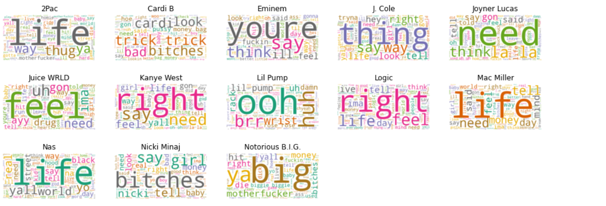
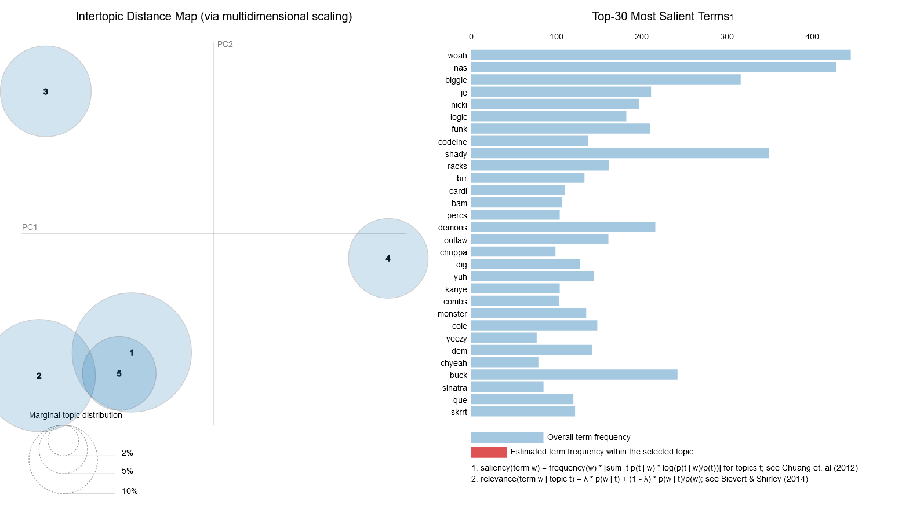

<!--
*** Thanks for checking out the Best-README-Template. If you have a suggestion
*** that would make this better, please fork the repo and create a pull request
*** or simply open an issue with the tag "enhancement".
*** Thanks again! Now go create something AMAZING! :D
-->


<!-- PROJECT SHIELDS -->
<!--
*** I'm using markdown "reference style" links for readability.
*** Reference links are enclosed in brackets [ ] instead of parentheses ( ).
*** See the bottom of this document for the declaration of the reference variables
*** for contributors-url, forks-url, etc. This is an optional, concise syntax you may use.
*** https://www.markdownguide.org/basic-syntax/#reference-style-links
-->

<br />
<p align="center">
  <a href="https://github.com/othneildrew/Best-README-Template">
    
  </a>

  <h3 align="center">Rap Lyrics visualization</h3>

  <p align="center">
    An analysis of Rap Lyrics
    <br />
    <a href="https://github.com/Neihtq/Rap-lyrics-visualizations/issues">Report Bug</a>
    ·
    <a href="https://github.com/Neihtq/Rap-lyrics-visualizations/issues">Request Feature</a>
  </p>
</p>


<!-- TABLE OF CONTENTS -->
<details open="open">
  <summary>Table of Contents</summary>
  <ol>
    <li>
      <a href="#about-the-project">About The Project</a>
      <ul>
        <li><a href="#built-with">Built With</a></li>
      </ul>
    </li>
    <li>
      <a href="#getting-started">Getting Started</a>
      <ul>
        <li><a href="#prerequisites">Prerequisites</a></li>
        <li><a href="#installation">Installation</a></li>
      </ul>
    </li>
    <li><a href="#usage">Usage</a></li>
    <li><a href="#contributing">Contributing</a></li>
    <li><a href="#contact">Contact</a></li>
    <li><a href="#acknowledgements">Acknowledgements</a></li>
  </ol>
</details>


<!-- ABOUT THE PROJECT -->
## About The Project

<p align="center">
    
</p>

Rap is one of the four fundamental elements of Hip-Hop and has gained more popularity than ever since the beginning of this movement. However, this genre received lots of criticism from the media due to its often used aggressive language.

This criticism of the media has been always accompanying for years but now we Rap Music has reached a state where even rappers themselves criticize the current state of Rap. Eminem, one of the most famous and successful artist in this genre, released - without any indication or announcement - his 2018 surprise album 'Kamikaze'. Most of the tracks expresses his anger and discontent about the c urrent trends in Hip-Hop Music and he also makes fun and verbally attacks some other, younger Hip-Hop artists, that are currently trending.

Given the long history of Rap Music and how recent the aforementioned event is, one thoroughly consider whether the music itself, especially the text, has changed.

This Project scraped the lyrics from genius.com from 12 artists from different eras of Hip-Hop and analyzed them in terms of chosen words, statistics, sentiment and topics.

### Built With

This Project uses following libraries for Data Engineering, Analysis and Visualization:
* [Pandas](https://pandas.pydata.org/)
* [scikit-learn](https://scikit-learn.org/stable/)
* [gensim](https://radimrehurek.com/gensim/)
* [nltk](https://www.nltk.org/)
* [matplotlib](https://matplotlib.org/)
* [wordcloud](http://amueller.github.io/word_cloud/)
* [Jupyter](https://jupyter.org/)

Webscraping/Lyrics aqcuisition was done with these libraries:
* [Beautiful soup](https://www.crummy.com/software/BeautifulSoup/bs4/doc/)
* [Selenium](https://www.selenium.dev/)
* [Webdriver Manager](https://github.com/SergeyPirogov/webdriver_manager)

*Note: At the time of this creation I was not aware of the official [Genius API](https://docs.genius.com/) which is why I did web scraping for aqcuiring the data.*


<!-- GETTING STARTED -->
## Getting Started

You can run these notebook on your end and the script for downloading lyrics can be used for other artist as well, as long as the URLs passed on are from Genius.

### Prerequisites

With `pipenv` we can easily install all dependencies listed above:
  ```sh
  pipenv install
  ```

### The Notebooks

The notebooks contain text cells which explain each analysis step.
* [Data Preprocessing]()
* [Exploratory Analysis]()
* [Sentiment Analysis]()
* [Topic Modeling]()


<!-- USAGE EXAMPLES -->
## Usage of Genius Lyrics Downloader

TODO: Add argparse for lyric downloader

The python script can be found in `utils/genius_scraper.py`.


<!-- CONTRIBUTING -->
## Contributing

Contributions are what make the open source community such an amazing place to be learn, inspire, and create. Any contributions you make are **greatly appreciated**.

1. Fork the Project
2. Create your Feature Branch (`git checkout -b feature/AmazingFeature`)
3. Commit your Changes (`git commit -m 'Add some AmazingFeature'`)
4. Push to the Branch (`git push origin feature/AmazingFeature`)
5. Open a Pull Request


<!-- CONTACT -->
## Contact
Github: [neihtq](https://github.com/Neihtq)

E-mail: q.thien.nguyen@outlook.de

[LinkedIn](https://www.linkedin.com/in/thien-quang-nguyen-808101143/)


<!-- ACKNOWLEDGEMENTS -->
## Acknowledgements
* [Best-README-Template](https://github.com/othneildrew/Best-README-Template#license)

[product-screenshot]: images/screenshot.png
